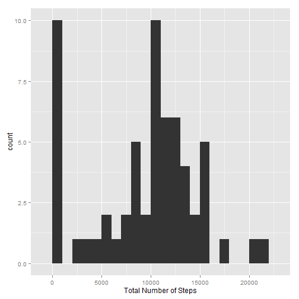
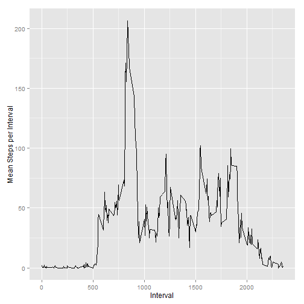
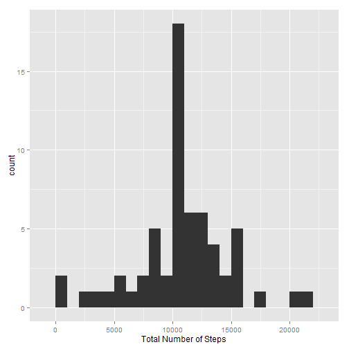
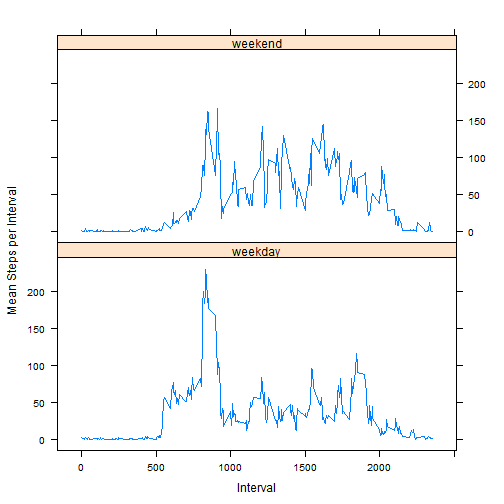

## Load required packages

```r
library(dplyr)
library(ggplot2)
library(lattice)
```

## Loading and preprocessing the data

```r
df_data <- read.csv(unz("activity.zip", "activity.csv"))
df_data$date <- as.Date(df_data$date, format = "%Y-%m-%d")
```

## What is mean total number of steps taken per day?

```r
# group data by date and sum steps per day
df_data_grouped_by_date <- group_by(df_data, date)
df_sum_steps_per_day <- summarize(df_data_grouped_by_date, 
                                  steps_per_day = sum(steps, na.rm = TRUE))

# plot histogram
qplot(steps_per_day, data = df_sum_steps_per_day, binwidth=1000) +
        xlab("Total Number of Steps")
```

 

```r
# mean and median total number of steps taken per day
mean(df_sum_steps_per_day$steps, na.rm = TRUE)
```

```
## [1] 9354.23
```

```r
median(df_sum_steps_per_day$steps, na.rm = TRUE)
```

```
## [1] 10395
```


## What is the average daily activity pattern?

```r
# group by interval and calculate mean taken steps per interval
df_data_grouped_by_interval <- group_by(df_data, interval)
df_mean_steps_of_interval <- summarize(df_data_grouped_by_interval, 
                                       mean_steps = mean(steps, na.rm = TRUE))

# plot time series plot
ggplot(df_mean_steps_of_interval, aes(x = interval , y = mean_steps )) +
        geom_line() +
        xlab("Interval") +
        ylab("Mean Steps per Interval")
```

 

```r
# Interval with maximum number of steps
df_mean_steps_of_interval$interval[which.max(df_mean_steps_of_interval$mean_steps)]
```

```
## [1] 835
```

## Imputing missing values

```r
# number of missing values
sum(is.na(df_data$steps))
```

```
## [1] 2304
```

- Missing step values are replaced by the mean for that 5-minute interval 
- Create a new dataset (df_data_new)
- Plot a historgam


```r
# left_join = return all rows from x, and all columns from x and y
df_data_joined <- left_join(df_data, df_mean_steps_of_interval, 
                            by = "interval")

# if step value is NA, then replace NA with mean step for that interval
df_data_NA_replaced_by_interval_mean <-  mutate(df_data_joined, 
                                                steps = ifelse(is.na(steps), 
                                                mean_steps, steps))
# create new data set
df_data_new <-  df_data_NA_replaced_by_interval_mean[,c(1:3)]

# group data by date and sum steps per day 
df_data_new_grouped_by_date <- group_by(df_data_new, date)
df_sum_steps_per_day <- summarize(df_data_new_grouped_by_date, 
                                  steps_per_day = sum(steps, na.rm = TRUE))

# plot histogram
qplot(steps_per_day, data = df_sum_steps_per_day, binwidth=1000) +
        xlab("Total Number of Steps")
```

 

```r
# mean and median total number of steps taken per day
mean(df_sum_steps_per_day$steps)
```

```
## [1] 10766.19
```

```r
median(df_sum_steps_per_day$steps)
```

```
## [1] 10766.19
```

After replacing the NAs of the step variable, the mean and median total number of steps taken per day are equal.
The first bucket of the histogram has now less counts. 

## Are there differences in activity patterns between weekdays and weekends?

```r
# Set Aspects of the Locale
Sys.setlocale("LC_TIME", "English")
```

```
## [1] "English_United States.1252"
```

```r
# create factor variable day: weekday (Mo, Tu, We, Th, Fr), weekend (Sa, Su)
df_data_new <- mutate(df_data_new, 
                      day = as.factor(
                              ifelse(weekdays(df_data_new$date) == "Saturday"  | 
                                        weekdays(df_data_new$date) == "Sunday",
                                     "weekend", "weekday")))

# group by interval and day and calculate mean taken steps per interval
df_data__new_grouped_by_interval_day <- group_by(df_data_new, interval, day)

df_mean_steps_of_interval <- summarize(df_data__new_grouped_by_interval_day, 
                                       mean_steps = mean(steps))

# Panel plot
xyplot( mean_steps ~  interval| factor(day), data = df_mean_steps_of_interval, 
        layout = c(1,2),
        type = 'l',
        xlab="Interval", 
        ylab="Mean Steps per Interval")
```

 


